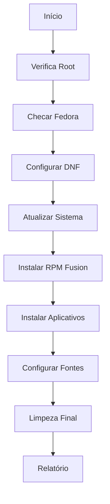

Vou elaborar um README completo e bem formatado em português:

# Fedora Post-Install Setup Script


Script de configuração pós-instalação para Fedora Linux com instalação de softwares essenciais e otimizações de sistema.

## 📌 Visão Geral

Este script automatiza as seguintes tarefas em uma instalação nova do Fedora:

1. **Configurações Básicas do Sistema**
2. **Instalação de Repositórios Adicionais**
3. **Atualização Completa do Sistema**
4. **Instalação de Softwares Essenciais**
5. **Configuração de Ambiente de Desenvolvimento**

## ⚙️ Funcionalidades Principais

### 🔧 Configurações do Sistema
- Otimização do DNF (gerenciador de pacotes)
- Habilitar downloads paralelos
- Seleção automática de mirrors mais rápidos

### 📦 Repositórios Adicionais
- RPM Fusion (free e non-free)
- Repositório do VirtualBox
- Repositório do Spotify
- Repositório do Stremio

### 🖥 Aplicativos Instalados
| Categoria        | Softwares                                                                 |
|------------------|---------------------------------------------------------------------------|
| Virtualização    | VirtualBox 6.1 com drivers de kernel                                      |
| Comunicação      | Telegram Desktop                                                          |
| Multimídia       | Spotify, Stremio, codecs de áudio/vídeo                                   |
| Ferramentas      | Warp Terminal (moderno terminal baseado em Rust)                          |
| Fontes           | Pacote completo de fontes Microsoft (Arial, Times New Roman, etc.)       |

### 🛡 Controle e Segurança
- Verificação de execução como root
- Detecção automática de sistemas baseados em ostree
- Tratamento de erros detalhado
- Rollback automático em caso de falha crítica

## 📋 Pré-requisitos

- Sistema Fedora 36 ou superior
- Conexão com internet estável
- 15GB de espaço livre em disco
- Acesso de superusuário (sudo)

## 🚀 Como Usar

1. **Download do script**
   ```bash
   wget https://exemplo.com/fedora-setup.sh
   ```

2. **Permissão de execução**
   ```bash
   chmod +x fedora-setup.sh
   ```

3. **Execução com logs detalhados**
   ```bash
   sudo ./fedora-setup.sh 2>&1 | tee install.log
   ```

4. **Processo de instalação**
   - Tempo estimado: 15-45 minutos (dependendo da conexão)
   - Serão solicitadas confirmações durante a instalação
   - Reinicialização automática opcional ao finalizar

## 🧩 Componentes Detalhados

### 🔄 RPM Fusion
- Habilita suporte a codecs proprietários
- Permite instalação de softwares não-livres
- Inclui drivers NVIDIA proprietários

### 📟 Warp Terminal
- Terminal moderno com GPU acceleration
- Auto-complete inteligente
- Integração com ferramentas de desenvolvimento

### 🖼 Microsoft Fonts
- Fontes essenciais para compatibilidade:
  - Arial
  - Times New Roman
  - Wingdings
  - Andale Mono

## 📊 Sistema de Logs

- Registro completo em `/var/log/fedora_setup.log`
- Níveis de log:
  - `INFO`: Operações bem-sucedidas
  - `WARNING: Notificações importantes
  - `ERROR`: Falhas críticas
- Formato:
  ```log
  [2023-08-20 14:30:45] INFO: System update completed
  [2023-08-20 14:35:12] ERROR: Failed to install package XYZ
  ```

## ⚠️ Considerações Importantes

1. **VirtualBox**
   - Requer rebuild dos módulos de kernel
   - Usuário adicionado ao grupo `vboxusers`
   - Serviço `vboxdrv` iniciado automaticamente

2. **Sistemas Atomic/ostree**
   - Instalação do Warp pode requerer steps manuais
   - Algumas configurações são persistentes via layering

3. **Fontes Microsoft**
   - Pacote `ttf-mscorefonts-installer`
   - Aceitação automática de EULA
   - Cache de fontes atualizado

## 🔄 Fluxo de Instalação



## 📜 Licença

Este projeto está licenciado sob a [GPL-3.0 License](LICENSE)

---

**Nota:** Sempre verifique scripts de terceiros antes de executar em sistemas críticos. Recomenda-se testar em ambiente controlado antes de usar em produção.
